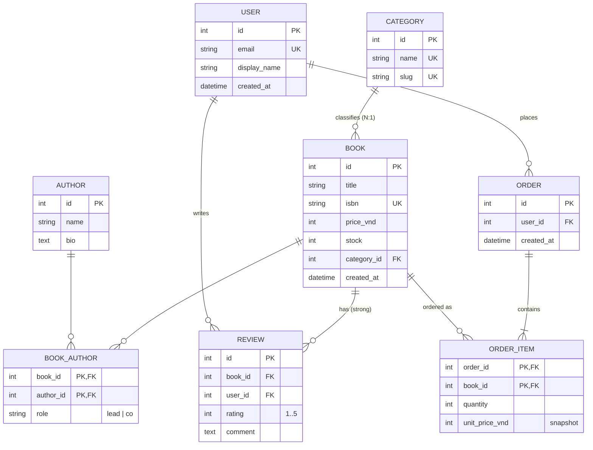

## ERD

```mermaid
erDiagram
    CATEGORY ||--o{ BOOK : "classifies (N:1)"
    BOOK ||--o{ BOOK_AUTHOR : ""
    AUTHOR ||--o{ BOOK_AUTHOR : ""
    BOOK ||--o{ REVIEW : "has (strong)"
    USER ||--o{ REVIEW : writes
    USER ||--o{ ORDER : places
    ORDER ||--|{ ORDER_ITEM : contains
    BOOK ||--o{ ORDER_ITEM : "ordered as"

    CATEGORY { int id PK
        string name UK
        string slug UK }
    AUTHOR { int id PK
        string name
        text bio }
    BOOK { int id PK
        string title
        string isbn UK
        int price_vnd
        int stock
        int category_id FK
        datetime created_at }
    BOOK_AUTHOR { int book_id PK,FK
        int author_id PK,FK
        string role "lead | co" }
    USER { int id PK
        string email UK
        string display_name
        datetime created_at }
    REVIEW { int id PK
        int book_id FK
        int user_id FK
        int rating "1..5"
        text comment }
    ORDER { int id PK
        int user_id FK
        datetime created_at }
    ORDER_ITEM { int order_id PK,FK
        int book_id PK,FK
        int quantity
        int unit_price_vnd "snapshot" }
```
